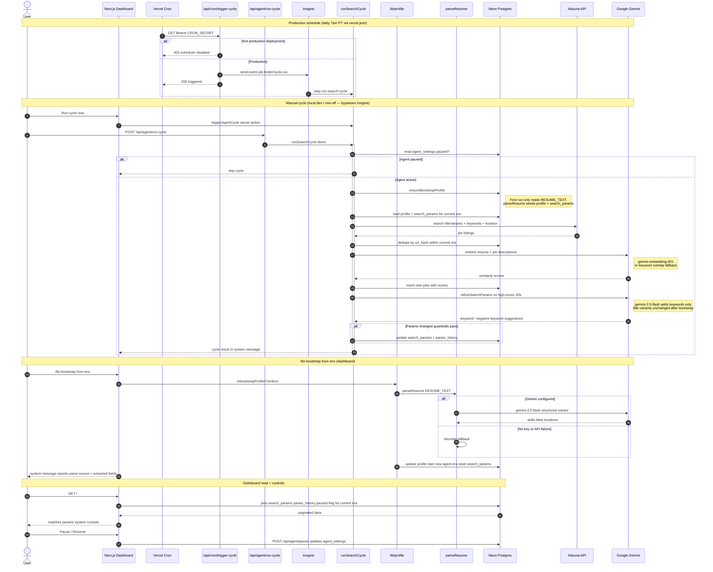

# Job Finder Agent — sequence flow

Current end-to-end behavior (Neon + Inngest + Adzuna + Gemini).


**Source:** [agent-flow.mmd](./agent-flow.mmd)

**Regenerate PNG:**

```bash
npx @mermaid-js/mermaid-cli -i docs/agent-flow.mmd -o docs/agent-flow.png -b white
```



## Entry points

| Trigger | Path | Runs |
|---------|------|------|
| **Cron** (production only) | `vercel.json` → `/api/cron/trigger-cycle` | Inngest → `runSearchCycle` |
| **Dashboard** | **Run cycle now** server action | `runSearchCycle` directly (no Inngest) |
| **Manual API** | `POST /api/agent/run-cycle` | `runSearchCycle` directly |
| **Inngest dev** | Event `job-finder/cycle.run` via dev UI | Same as cron |
| **Re-bootstrap** | Dashboard **Re-bootstrap from env** | `rebootstrapProfileFromEnv` → `parseResume` → new era |

Local development does not require `npm run inngest:dev` unless you are testing the Inngest event path.

## Bootstrap and resume parsing

On first cycle, `ensureBootstrapProfile` reads `RESUME_TEXT`, calls `parseResume`, and seeds the profile plus initial `search_params` (up to 8 keywords from skills, up to 3 title variants from titles).

`parseResume` uses **Gemini 2.5 Flash** when `GOOGLE_GENERATIVE_AI_API_KEY` is set; otherwise it uses a **heuristic parser** (or falls back on API failure). Re-bootstrap from the dashboard repeats this flow, starts a **new agent era**, and resets search params. Prior jobs and param history remain archived in the database.

## Agent loop (`runSearchCycle`)

Each cycle loads the profile and current search params for the **active era**, searches Adzuna, dedupes by URL hash within that era, scores new jobs, and refines **keywords** (not title variants) from high-scoring job descriptions. Guardrails: max 5 keywords per cycle, evidence from ≥ 2 jobs.
