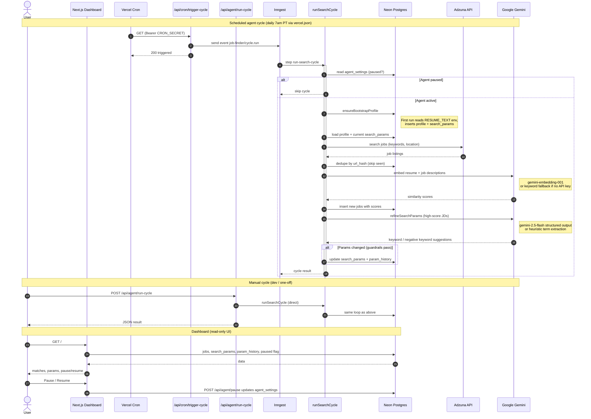

# Job Finder Agent — sequence flow

Current end-to-end behavior (Neon + Inngest + Adzuna + Gemini).

**PDF:** [agent-flow.pdf](./agent-flow.pdf) (regenerate: `npx @mermaid-js/mermaid-cli -i docs/agent-flow.mmd -o docs/agent-flow.pdf -b white`)

## Entry points

| Trigger | Path | Runs |
|---------|------|------|
| **Cron** | `vercel.json` → `/api/cron/trigger-cycle` | Inngest → `runSearchCycle` |
| **Manual** | `POST /api/agent/run-cycle` | `runSearchCycle` directly |
| **Inngest dev** | Event `job-finder/cycle.run` | Same as cron |

## Bootstrap (first cycle only)

If no profile exists in Neon, `ensureBootstrapProfile` reads `RESUME_TEXT` from the environment, parses skills/titles, and seeds `search_params` v0.
